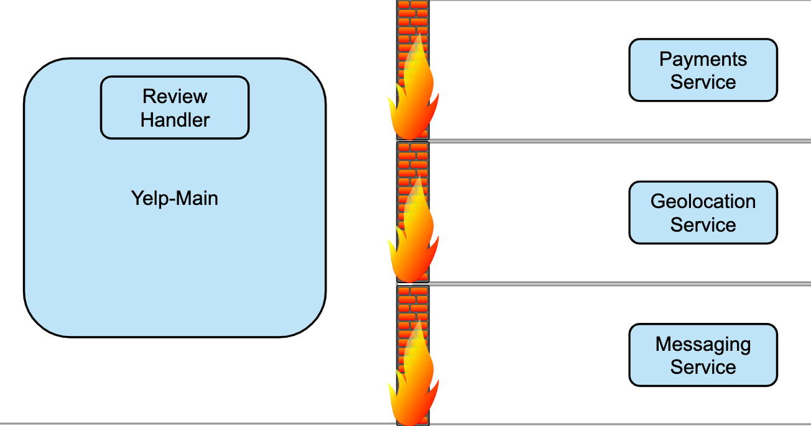

# How Yelp Moved Security from the App to the Mesh with Envoy and OPA

| [Event](https://sched.co/UaZT) | [Presentation](presentation/kubecon_2019_how_yelp_moved_security_from_the_app_to_the_mesh_with_envoy_and_opa.pdf)
| - | - |

**Speakers**
* Daniel Popescu, Yelp
* Ben Plotnick, Cruise

**Notes**
* Yelp replaced a legacy proxy service with service mesh and OPA
* legacy proxy service used a Walled Garden approach

* istio allows for workloads that are both secured and generalized, without the excessive/costly isolation
* authn (who are you?)
  * proof through basic auth, API keys, x509 certs
  * authn methods:
    * none
      * service can be directly leveraged through curl
    * application
      * service can be leveraged through header-modified curl to envoy
    * service mesh
      * service can be reached by mimicking elements of envoy communication
    * service mesh + mTLS
      * handles identity resolution for systems and humans
      * identity cannot be forged
      * no impact to dev velocity
* authz (what can you do?)
  * enforced through IAM policies, RBAC
  * principle of lease privilege (deny by default)
  * policies must be easy to use and understand
  * OPA far better than custom solution with ever growing services that would need support
    * steep learning curve for Rego
    * build an abstraction layer for expressing simple HTTP rules
    * transpile to data structure for fast lookups in OPA
* checkout OPA authorization results dashboard
* OPA can govern over
  * docker authz
  * SSH and sudo
  * terraform
  * kafka