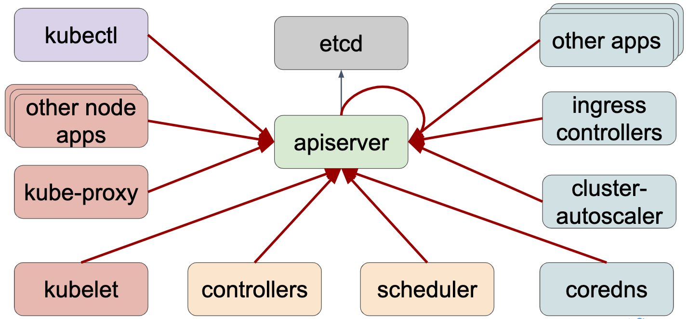
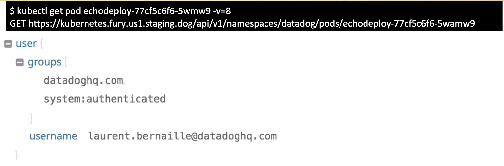
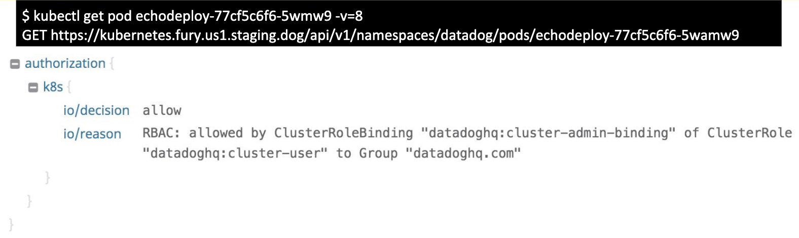
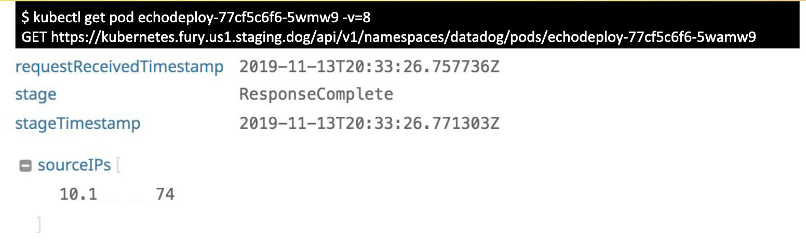

# Making the Most Out of Kubernetes Audit Logs

| [Event](https://sched.co/Uab7) | [Presentation](presentation/Making%20the%20Most%20out%20of%20Kubernetes%20Audit%20Logs.pdf)
| - | - |

**Speakers**
* Laurent Bernaille, Datadog
* Robert Boll, Datadog

**Notes**
* Datadog is really killing it in the metrics and telemetry avenues
* 10K hosts, dozens of clusters, clusters range from 50 to 3000 nodes!
* Many aspects to gather data on!

* kubectl is just a wrapper for curling the kube-api
  * ```kubectl get pod <pod> -v=8``` really means "GET https://<apiserver-endpoint>/api/v1/namespaces/datadog/pods/<pod>
* apiserver outputs rich structured json logs with configurable verbosity
* logging can occur during:
  * apiserver receives request (```RequestReceived```)
  * apiserver processes request (```RequestProcessed```)
  * apiserver responds (```RequestResponse```)
* each request also includes:
  * who initiated the request (i.e. username, groups)

  * how they are authorized to make the request (i.e. authorization -> k8s = "allowed by ClusterRoleBinding...of ClusterRole...to Group...")

  * when and where

* configure apiserver for audit logs (minimal):
  * where to store: ```--audit-log-path=/var/log/kubernetes/apiserver/audit.log```
  * what to collect: ```--audit-policy-file=/etc/kubernetes/audit-policies/policy.yaml```
    * set max size, webhook, batching mode?
* audit policy example (log pod changes at RequestResponse level):
```
apiVersion: audit.k8s.io/v1
kind: Policy
rules:
- level: RequestResponse
  omitStages:
  - "RequestReceived"
  resources:
  - group: ""
    resources: ["pods"]
  verbs: ["create", "patch", "update", "delete"]
```
* experience shows ```DaemonSets``` (i.e. kube-proxy) and kubelet are most taxing on cluster performance especially in very large clusters
* k8s deployment sequence:
  1. user creates ```Deployment```
  2. deployment controller creates ```ReplicaSet```
  3. ReplicaSet controller creates ```Pods```
  4. Scheduler binds ```Pods```
  5. Kubelets update ```Pods``` status
* troubleshooting
  * RCAs (the why perhaps through investigating HTTP status codes)
    * ```403``` may mean RBAC misconfiguration or unauthorized app activity
    * ```401``` may mean expired certificates
  * debug performance regressions or improve performance