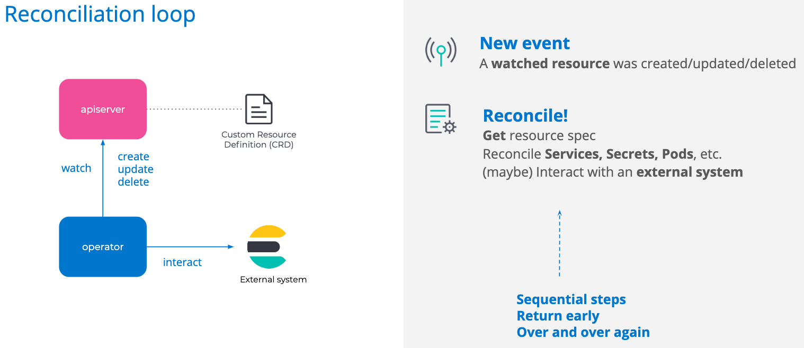

# Writing a Kubernetes Operator: the Hard Parts

| [Event](https://sched.co/UaeV) | [Presentation](presentation/Writing%20a%20Kubernetes%20operator%20-%20the%20Hard%20Parts%20-%20KubeCon%202019.pdf)
| - | - |

**Speakers**
* Sébastien Guilloux, Elastic

**Notes**
* Kubernetes operators in a nutshell
  * reconciliation loop

* apiserver clients use a cached reader by default. this presents potential problems:
  * infinite pod creation loop: pod missing? create one. pod missing? create one
  * split brain situation: 3 nodes? quorum=2, add a 4th node, quorum=3, 3 nodes? quorum=2
  * double rolling upgrade reaction: need to upgrade? delete + recreate pods, need to upgrade? delete + recreate already upgraded pods
* suitable solution: optimistic concurrency
  * conflict on create/update/deletion to avoid duplication
  * for stateful workloads, use [```Expectations```](https://github.com/kubernetes/kubernetes/blob/master/pkg/controller/controller_utils.go)
* other best practices:
  * use deterministic naming (be as telling as possible, short and sweet)
  * always assume a stale cache
  * entire reconciliation should be idempotent
* best method to reconcile resources is to hash but note ```actual hash``` is built at creation time and won't include defaulted fields
* use pod templates for good defaults
* testing
  * unit test as much as possible
  * unit tests for the entire reconciliation are hard due to too many code paths
  * kubebuilder allows for local integration tests using a local apiserver + etcd process
  * end-to-end tests:
    1. spawn a k8s cluster
    2. deploy the operator
    3. run tests
      * create an ES cluster
      * verify availability
      * mutate cluster
      * verify
      * confirm no downtime or data loss during mutation