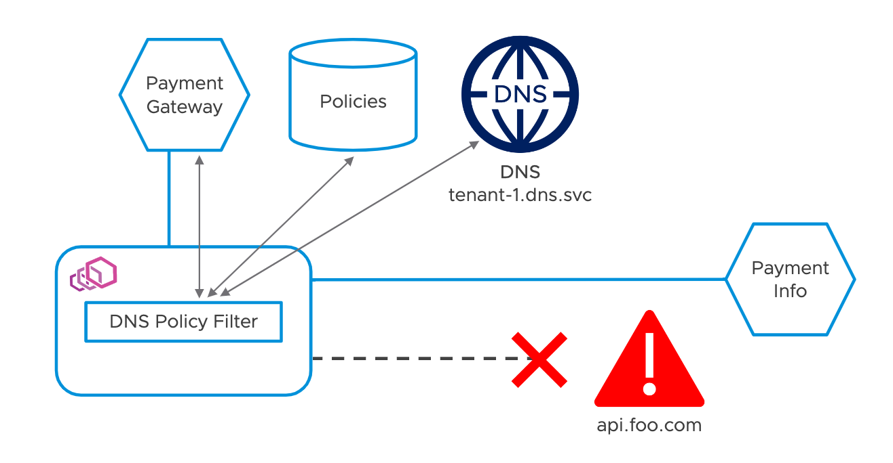

# Making the Most Out of Kubernetes Audit Logs

| [Event](https://sched.co/UacZ) | [Presentation](presentation/Rethinking%20the%20K8s%20DNS%20for%20the%20Modern%20Enterprise.pdf)
| - | - |

**Speakers**
* Deepa Kalani, VMware
* Venil Noronha, VMware

**Notes**
* Service Mesh Capabilities
  * Identity
  * Service Discovery/DNS
  * Routing
  * Policy
* devs should be able to deploy and mgirate apps across any cloud provider (*read cluster*) without changing their native workloads (or much of their configurations)
* monitor/observe DNS queries and responses for behavioral analysis of tenants
* DNS policies should not only enforce but also log attempts:
  * i.e. TenantA services should not discover TenantB services
  * apply L4/L7 policies based on DNS queries/responses
    * e.g. deny *.com, allow *.cluster.local
* current state (of limitations) of Kubernetes DNS
  * no tenant isolation for DNS
  * no dynamic configuration of DNS
  * policies cannot be enforced at the DNS layer 
  * no 1st-class support for secure DNS:
    * DNS-over-TLS (DoT)
    * DNS-over-HTTPS (DoH)
* envoy allows for dynamic configuration of filters via ```DnsPolicy```

